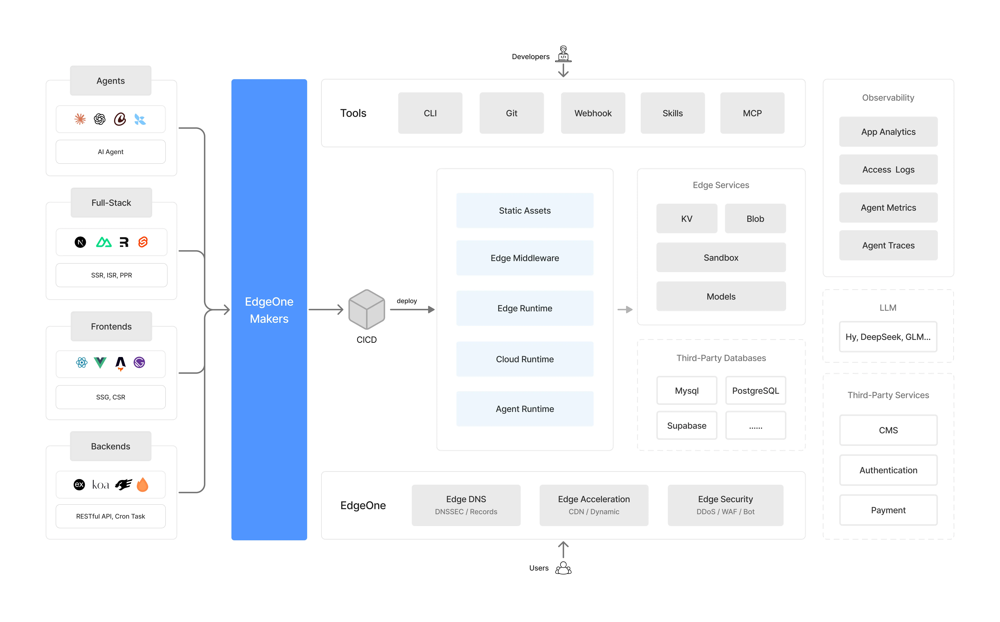

## 一、什么是 EdgeOne Makers

EdgeOne Makers 是**腾讯云 EdgeOne** 推出的全栈开发部署平台，前身为 EdgeOne Pages。它基于腾讯云全球 3200+ 边缘节点，提供静态网站托管、边缘函数计算、对象存储等一体化能力。

相较于传统的云服务器部署，EdgeOne Makers 具备以下特点：

- **开箱即用**：无需管理服务器，推送代码即可完成部署
- **全球加速**：依托 EdgeOne 边缘网络，实现全球低延迟访问
- **安全防护**：内置 DDoS 防护、Web 防火墙等安全能力
- **全栈能力**：支持纯静态网站 + 边缘函数（Edge Functions）混合架构



## 二、为什么选择 GitHub Actions

GitHub Actions 是 GitHub 官方提供的 CI/CD 工具，可以在代码推送、PR 合并等事件发生时自动执行构建、测试、部署等任务。结合 EdgeOne Makers 使用，可以实现**"代码推送 → 自动构建 → 自动部署"**的完整自动化流程。

优势包括：

1. **零额外成本**：GitHub Actions 免费额度足够个人项目使用
2. **与代码仓库深度集成**：修改代码后自动触发部署
3. **丰富的 Action 生态**：Checkout、Setup Node、pnpm 等现成 Action 开箱即用
4. **环境变量与 Secrets**：安全托管 API Token 等敏感信息

### EdgeOne Makers 内置构建环境的局限

EdgeOne Makers 本身也支持在平台内直接构建并部署，看似"零配置"，但其内置构建环境存在两个绕不开的短板。正因如此，本文采用 **「GitHub Actions 负责构建 + EdgeOne Makers 负责托管」** 的分工模式，把构建环节彻底交给 GitHub Actions：

1. **Node 版本只能从平台预设的几个版本中选择，无法任意指定**

   根据 EdgeOne 官方《构建指南》，Makers 构建环境**仅预装**了以下 Node 版本：

   ```
   14.21.3、16.20.2、18.20.4、20.18.0、22.11.0、22.17.1、24.5.0
   ```

   你只能在「项目设置 → Node.js 版本」下拉菜单中挑选其中之一；虽然也可以通过根目录的 `.nvmrc` 指定其他版本，但平台会重新下载该版本且**不包含 pnpm / yarn / bun 等包管理器**，对使用 pnpm 的项目并不友好。`edgeone.json` 文档更是明确警告："若填写其他版本号，可能导致部署失败"。（上述平台版本限制与构建环境约束的官方说明，详见文末[参考文档](#参考文档)）

   而 GitHub Actions 通过 `actions/setup-node` 可以**自由指定任意 Node 版本**（如本文的 `26`），不受平台白名单限制。

2. **默认构建环境配置弱于 GitHub Actions，且不可自定义**

   Makers 的构建任务运行在平台统一的共享沙箱中，其 CPU、内存等规格并未在公开文档中给出，也**无法像 GitHub Actions 那样自主选择更高规格的运行器**。对于依赖安装量大、构建耗时长的项目（如带大量图片优化的 Astro 站点），平台默认构建环境更容易出现资源紧张、构建偏慢的问题。

下表直观地对比了两者在构建能力上的差异：

| 对比项                  | EdgeOne Makers 默认构建环境                                                                                   | GitHub Actions 运行器                                           |
| ----------------------- | ------------------------------------------------------------------------------------------------------------- | --------------------------------------------------------------- |
| **Node 版本**           | 仅限平台预设的 7 个版本（14.21.3、16.20.2、18.20.4、20.18.0、22.11.0、22.17.1、24.5.0），其他版本无法选择切换 | 任意版本（18 / 20 / 22 / 26…），`setup-node` 自由指定           |
| **构建机器规格**        | 平台固定的共享沙箱，规格未公开且不可调                                                                        | 标准运行器约 2 vCPU / 7 GB 内存 / 14 GB SSD，可升级大规格运行器 |
| **包管理器 / 工具链**   | 受预装环境限制（`.nvmrc` 自定义版本不含包管理器）                                                             | 自由安装任意工具链（pnpm、yarn、bun 等）                        |
| **构建缓存**            | 平台托管，灵活性有限                                                                                          | 可缓存 pnpm/npm store、构建产物，显著加速                       |
| **私有依赖 / 密钥注入** | 依赖平台的环境变量配置                                                                                        | 通过 Secrets、缓存、服务容器灵活注入                            |

EdgeOne Makers 预装的 Node 版本目前都无法满足 Astro 要求的 Node版本，因此只能交给 GitHub Actions 构建，再仅用 EdgeOne CLI 上传产物。

## 三、准备工作

开始之前，需要完成以下准备工作。

### 3.1 开通 EdgeOne Makers

1. 访问 [EdgeOne Makers 控制台](https://console.edgeone.ai/makers)
2. 注册或登录腾讯云账号
3. 创建一个新项目（Project），记录下**项目名称**和**项目 ID**

   - **项目名称**：创建项目时由你自己输入，对应工作流中的 `EDGEONE_NAME`。
   - **项目 ID**：控制台页面上并不会直接显示，需要从**浏览器地址栏的 URL 中获取**。进入该项目后，地址栏形如 `https://console.edgeone.ai/makers/pages/<项目ID>/...`，其中路径里的那段标识符即为项目 ID，对应工作流中的 `EDGEONE_PROJECT_ID`。

   > 注意：新建的空项目在控制台中**必须至少上传一个文件**才能创建成功。由于后续我们会通过 GitHub Actions 自动部署真实构建产物，这里只需先上传一个极简的`index.html`文件占位即可，例如：
   >
   > ```html
   > <!doctype html>
   > <html>
   >   <head>
   >     <meta charset="utf-8" />
   >     <title>placeholder</title>
   >   </head>
   >   <body>
   >     <h1>Deploying...</h1>
   >   </body>
   > </html>
   > ```
   >
   > 待工作流首次运行后，该占位内容会被自动覆盖。

### 3.2 获取 API Token

在 EdgeOne Makers 控制台中，进入 **设置 → API Token** 页面，点击创建一个新的 Token。Token 是部署时的身份凭证，需要妥善保管。

### 3.3 准备项目

本文以 **Astro** 静态博客为例，项目中已包含以下关键文件：

**`edgeone.json`**（项目根目录）- 定义项目的构建命令、安装命令和响应头配置。完整配置与字段详解见本文**第七节**。

## 四、配置 GitHub Secrets

在 GitHub 仓库中配置 Secrets，用于存放部署所需的敏感信息。

1. 进入你的 GitHub 仓库
2. 点击 **Settings → Secrets and variables → Actions**
3. 点击 **New repository secret**，依次添加以下三个 Secret：

| Secret 名称          | 说明             | 从哪里获取                  |
| -------------------- | ---------------- | --------------------------- |
| `EDGEONE_NAME`       | EdgeOne 项目名称 | EdgeOne 控制台项目设置页    |
| `EDGEONE_PROJECT_ID` | EdgeOne 项目 ID  | EdgeOne 控制台项目设置页    |
| `EDGEONE_API_TOKEN`  | API 访问令牌     | EdgeOne 控制台 API Token 页 |

配置完成后，这些 Secrets 可以在工作流中通过 `${{ secrets.SECRET_NAME }}` 引用。

> 不熟悉 Secrets 配置的同学，可参考 GitHub 官方文档：[《在 GitHub Actions 中使用机密》](https://docs.github.com/zh/actions/how-tos/write-workflows/choose-what-workflows-do/use-secrets)。

## 五、创建 GitHub Actions 工作流

在项目根目录下创建 `.github/workflows/deploy-edgeone.yml` 文件。下面逐段解读完整的工作流配置。

### 5.1 触发条件

```yaml
name: Deploy to EdgeOne Makers

on:
  push:
    branches:
      - main
  workflow_dispatch:
```

- `push` 事件：当代码推送到 `main` 分支时自动触发部署
- `workflow_dispatch`：支持在 GitHub Actions 页面手动点击运行

### 5.2 检出代码

```yaml
jobs:
  deploy:
    runs-on: ubuntu-latest
    steps:
      - name: Checkout
        uses: actions/checkout@v7
```

`runs-on: ubuntu-latest` 指定整个 `deploy` 任务运行在 GitHub 托管的 Ubuntu 最新版运行器上（标准运行器约 2 vCPU / 7 GB 内存 / 14 GB SSD），后续所有 `steps` 都在该环境中顺序执行；相比 EdgeOne Makers 未公开的共享沙箱，这里可以稳定获得可预期的机器规格。`actions/checkout@v7` 用于将仓库代码检出到该运行环境中，相当于在本地执行 `git clone`。

### 5.3 安装包管理器

本项目使用 pnpm 作为包管理器，因此需要先安装。不同的包管理器安装方式不同：若使用 pnpm 则启用 `pnpm/action-setup@v6`，使用 yarn / npm 则无需额外安装（下节 `actions/setup-node` 已内置）。至于 bun——由于它是 Node.js 兼容的运行时与包管理器，将在下一节「安装运行时」中与 Node.js 一并说明。为防止步骤冲突，同一时间只启用一个，其余注释掉：

```yaml
# ① pnpm（默认）
- name: 安装 pnpm
  uses: pnpm/action-setup@v6

# ② yarn / npm（无需额外安装，下方 Setup Node.js 已内置）
# 无安装步骤
```

`pnpm/action-setup@v6` 会自动识别 `package.json` 中的 `packageManager` 字段并安装对应版本。

### 5.4 安装运行时（Node.js / bun）

本项目需要 JavaScript 运行时，Node.js 与 bun 二选一。bun 是 **Node.js 兼容**的运行时与包管理器：它能直接运行 JS / TS 代码，兼容 `package.json` 与 npm 生态，可整体替代「Node.js + npm/pnpm」。

```yaml
# ① Node.js（pnpm / yarn / npm 使用）
- name: Setup Node.js
  uses: actions/setup-node@v7
  with:
    # 按项目需求设置 Node.js 版本
    node-version: 26
    # cache 仅支持 npm / yarn / pnpm
    cache: pnpm

# ② bun（https://github.com/oven-sh/setup-bun）
# - name: Setup bun
#   uses: oven-sh/setup-bun@v2
#   with:
#     cache: true
```

**选择 Node.js 时**

- 通过 `actions/setup-node` 安装指定版本的 Node.js（示例为 `26`，可按项目需求调整）
- 启用 `cache: pnpm` 缓存 `pnpm store` 以加速构建；注意 `cache` 字段仅支持 `npm` / `yarn` / `pnpm`

**选择 bun 时**

- bun 兼容 Node.js 生态，可直接运行 JS / TS 项目，通常可省略上方「Setup Node.js」步骤
- 依赖缓存改用 `oven-sh/setup-bun` 中的 `cache: true`
- 后续部署步骤中的 `npx` 命令需一并改为 `bunx`（详见 5.6 节）

### 5.5 创建项目链接文件

```yaml
- name: Create EdgeOne Project Link File
  run: |
    mkdir -p .edgeone
    echo '{"Name":"${{ secrets.EDGEONE_NAME }}","ProjectId":"${{ secrets.EDGEONE_PROJECT_ID }}"}' > .edgeone/project.json
```

这一步看似只是写一个 JSON 文件，却是整个工作流能否成功的关键。其根本原因在于 **EdgeOne CLI 在部署前必须先「关联项目」**，具体要注意两点：

1. **不关联项目 ID 会触发「自动新建项目」，进而因重名冲突而失败**

   CLI 执行 `makers deploy` 时，需要知道把构建产物上传到哪个项目；这个关联关系记录在 `.edgeone/project.json` 中（包含项目 `Name` 与 `ProjectId`）。如果本地不存在该文件、或其中的 `ProjectId` 无效，CLI 会尝试以 `Name` 为项目名**新建一个项目**。但本项目在 EdgeOne 控制台早已存在同名项目，此时新建就会因为**项目名冲突**导致部署失败。因此必须在 CI 中显式写入正确的 `ProjectId`，让 CLI 直接指向已有项目，而不是去新建。

2. **`edgeone makers link` 命令无法在 CI 环境使用**

   EdgeOne CLI 确实提供了 `edgeone makers link` 命令用于关联项目，但该命令需要**在交互式终端中手动选择目标项目**，无法在非交互的 GitHub Actions Runner 中自动完成。所以我们才用「直接写入 `.edgeone/project.json`」的方式，在流水线里**无交互**地建立项目关联。

> 小结：本步骤写入的 `Name` 与 `ProjectId` 均来自前面配置的 GitHub Secrets，缺一不可——`Name` 用于识别项目，`ProjectId` 用于精准指向已有项目、避免重名新建。

### 5.6 执行部署

```yaml
- name: Deploy to EdgeOne
  run: |
    npx edgeone makers deploy -t ${{ secrets.EDGEONE_API_TOKEN }} -e production
```

最后一步，使用 EdgeOne CLI 的 `makers deploy` 命令执行部署：

- `npx edgeone`：通过 npx 运行 `@edgeone/cli` 包
- `makers deploy`：EdgeOne Makers 的部署命令
- `-t`：传入 API Token 进行身份认证
- `-e production`：指定部署到生产环境

**若使用 bun 环境**：`npx` 需替换为 `bunx`，即：

```yaml
run: |
  bunx edgeone makers deploy -t ${{ secrets.EDGEONE_API_TOKEN }} -e production
```

`bunx` 是 bun 自带的、与 `npx` 等价的可执行包运行工具，可在此替代 `npx`。

CLI 会自动读取项目根目录的 `edgeone.json` 配置，执行 `installCommand`（安装依赖）和 `buildCommand`（构建项目），然后将构建产物上传至 EdgeOne 边缘网络。

## 六、完整工作流文件

整合以上所有步骤，完整的 `.github/workflows/deploy-edgeone.yml` 文件如下：

```yaml
name: Deploy to EdgeOne Makers

on:
  push:
    branches:
      - main
  workflow_dispatch:

jobs:
  deploy:
    runs-on: ubuntu-latest

    steps:
      # 1. 检出代码
      - name: Checkout
        uses: actions/checkout@v7

      # 2. 安装包管理器（按需选择，未使用的注释掉以防冲突）
      # ① pnpm（默认）
      - name: 安装 pnpm
        uses: pnpm/action-setup@v6
      # ② yarn / npm（无需额外安装，下方 Setup Node.js 已内置）
      # 无安装步骤

      # 3. 安装运行时（Node.js / bun）
      # ① Node.js（pnpm / yarn / npm 使用）
      - name: Setup Node.js
        uses: actions/setup-node@v7
        with:
          # 按项目需求设置 Node.js 版本
          node-version: 26
          # cache 仅支持 npm / yarn / pnpm
          cache: pnpm
      # ② bun（https://github.com/oven-sh/setup-bun）
      # - name: Setup bun
      #   uses: oven-sh/setup-bun@v2
      #   with:
      #     cache: true

      # 4. 创建 EdgeOne 项目链接文件
      - name: Create EdgeOne Project Link File
        run: |
          mkdir -p .edgeone
          echo '{"Name":"${{ secrets.EDGEONE_NAME }}","ProjectId":"${{ secrets.EDGEONE_PROJECT_ID }}"}' > .edgeone/project.json

      # 5. 部署到 EdgeOne（若使用 bun，将下方 npx 替换为 bunx）
      - name: Deploy to EdgeOne
        run: |
          npx edgeone makers deploy -t ${{ secrets.EDGEONE_API_TOKEN }} -e production
```

## 七、edgeone.json 配置详解

项目根目录的 `edgeone.json` 是 EdgeOne Makers 的核心配置文件，用于声明构建命令与部署行为。本项目的完整配置如下（注意 `headers` 字段不可省略，否则部署时将回退为平台默认响应头）：

```json
{
  "installCommand": "pnpm install --frozen-lockfile",
  "buildCommand": "pnpm build",
  "headers": [
    {
      "source": "/*",
      "headers": [
        { "key": "cache-control", "value": "public,max-age=300,immutable" },
        { "key": "x-content-type-options", "value": "nosniff" }
      ]
    },
    {
      "source": "/_astro/*",
      "headers": [
        {
          "key": "cache-control",
          "value": "public,max-age=31536000,immutable"
        },
        { "key": "x-content-type-options", "value": "nosniff" },
        { "key": "access-control-allow-origin", "value": "*" }
      ]
    },
    {
      "source": "/*.js",
      "headers": [
        {
          "key": "content-type",
          "value": "application/javascript;charset=utf-8"
        }
      ]
    },
    {
      "source": "/*.css",
      "headers": [{ "key": "content-type", "value": "text/css;charset=utf-8" }]
    }
  ]
}
```

配置要点：

- `installCommand`：依赖安装命令，`--frozen-lockfile` 保证锁定文件不被改写，构建环境一致
- `buildCommand`：构建命令（即 `astro check && astro build`）
- `headers`：按 URL 路径设置响应头，本项目分为四类：
  - `/*`：全局缓存 5 分钟（300 秒）+ 禁用 MIME 嗅探（`nosniff`）
  - `/_astro/*`：构建产物带内容哈希，缓存 1 年（31536000 秒）+ 允许跨域
  - `/*.js`、`/*.css`：显式声明 MIME 类型，确保浏览器正确解析

完整字段说明与进阶用法，请参考官方文档：[EdgeOne Makers《edgeone.json 配置详解》](https://pages.edgeone.ai/zh/document/edgeone-json)。

## 八、部署验证与监控

### 8.1 查看部署状态

将工作流文件推送到 `main` 分支后：

1. 进入 GitHub 仓库的 **Actions** 选项卡
2. 可以看到名为 **Deploy to EdgeOne Makers** 的工作流正在运行
3. 点击可查看详细的运行日志

### 8.2 访问网站

部署成功后，EdgeOne Makers 会自动分配一个预览域名。你也可以绑定自己的自定义域名。

### 8.3 自定义域名与 HTTPS

在 EdgeOne Makers 控制台的 **域名管理** 中：

1. 添加你自己的域名
2. 按照提示在 DNS 服务商处添加 CNAME 记录
3. 等待 SSL 证书自动签发（EdgeOne 会自动管理 HTTPS 证书）

## 九、常见问题与最佳实践

### 9.1 构建失败怎么办

- 检查 `edgeone.json` 中的 `installCommand` 和 `buildCommand` 是否正确
- 确认项目中存在 `package.json` 且依赖安装正常
- 在 Actions 日志中查看具体的报错信息

### 9.2 Secrets 泄露风险

- 永远不要在代码中硬编码 Token
- 定期轮换 API Token
- 为不同项目使用不同的 Token

### 9.3 部署预览环境

```yaml
# 在 PR 时部署到预览环境
on:
  pull_request:
    branches:
      - main
```

然后在部署步骤中将 `-e production` 改为 `-e preview`，即可为每个 PR 自动创建预览站点。

### 9.4 加速构建速度

- 启用 `cache: pnpm` 缓存依赖
- 将不变的大型依赖（如 `sharp`）移入 `dependencies` 而非 `devDependencies`
- 使用 `--frozen-lockfile` 避免安装时解析版本

## 十、总结

通过 GitHub Actions 与 EdgeOne Makers 的结合，我们实现了：

1. 代码推送即部署，无需手动操作
2. 利用边缘网络加速全球访问
3. 合理配置缓存策略，优化用户体验
4. 安全托管 API Token，保障凭证安全

这套自动化部署方案不仅适用于 Astro 项目，同样适用于 Vue、React、Hexo、Hugo 等任何能生成静态资源的前端框架。你可以参考本文的配置，快速搭建属于你自己的自动化部署流水线。

## 参考文档

本文涉及的文档与资源链接汇总如下：

- EdgeOne Makers 控制台：https://console.edgeone.ai/makers
- GitHub Actions《在 GitHub Actions 中使用机密》：https://docs.github.com/zh/actions/how-tos/write-workflows/choose-what-workflows-do/use-secrets
- EdgeOne Makers《构建指南（Node 版本）》：https://pages.edgeone.ai/zh/document/build-guide
- EdgeOne Makers《edgeone.json 配置详解》：https://pages.edgeone.ai/zh/document/edgeone-json
- 本文使用的 GitHub Actions：
  - `actions/checkout`：https://github.com/actions/checkout
  - `actions/setup-node`：https://github.com/actions/setup-node
  - `pnpm/action-setup`：https://github.com/pnpm/action-setup
  - `oven-sh/setup-bun`：https://github.com/oven-sh/setup-bun
